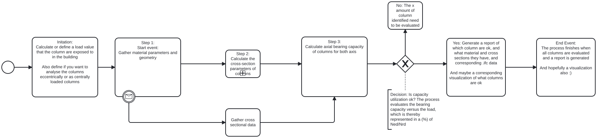

# A2 

# A2a: About Your group
**Q: How much do you agree with the following statement: I am confident coding in Python**

A: 9 or 3 for all of us. We are familiar with coding in python on a okay level.

**Q: What is your group’s focus area? Is you focus area keeping the manager role? Are you an analyst or a manager?**

A: Our group's focus area is structures. We are both analysts and managers at the time being.

# A2b: Identify Claim
**Q: Select which building(s) to focus on for your focus area**

A: We'll be focusing at building #2516

**Q: Identify a ‘claim’ / issue / fact to check from one of those reports.**

A: We looked at report 26-09-A, where they analyzed the structural columns in the building and quantified there usage, where some columns would exceed a usage of 100%. We hereafter looked into the code used to analyse the axial bearing capacity of the columns and found that the calculations were superficially calculated, and didn't handle the affect of material and cross-section area in their calculations.

Accordingly our assessment, will focus on creating a tool that can verify the axial bearing capacity of the columns in a more in-depth calculation, where we implement the correct structural formulas from eurocode for each column, where calculations are  dependent on cross sections types and material selection of set column.

# A2c: Use Case

**Q: How would you check this claim?**

A: We would develop a tool that checks the axial capacity of all structural columns in the IFC model. It would identify each column’s material, cross-section, and dimensions, then apply a suitable Eurocode-based calculation rather than using the same simplified method for every column. The tool would compare the calculated resistance with the design axial load and report each column’s utilization, along with any assumptions or missing information in the given columns.

**Q: When would this claim need to be checked?**

A: During the design phase, once column properties and design loads are available for an Ultimate Limit State (ULS) check. The check should be repeated if the column design or loads change.

**Q: What information does this claim rely on**

A: The check requires the following information regarding the columns: (Mangler skal ændres)

- Identity and location of each load-bearing column
- its material and grade; its cross-section and dimensions
- The member length and relevant support or bracing conditions
- The design axial force acting on it. 
- Reinforcement information is also needed for a reinforced concrete capacity check.

**Q: What phase? planning, design, build or operation.**

# A2d: Scope the use case
 

# A2e: Tool Idea

# A2f: Information Requirements
**Q: Identify what information you need to extract from the model

A: The needed infromation is geometric and material data for the coloumn that can be found in IFCcoloumn

# A2g: Identify appropriate software licence

**Q: What software licence will you choose for your project?**

A: Blender, Bonsai, Python, Visual Studio Code & Github

